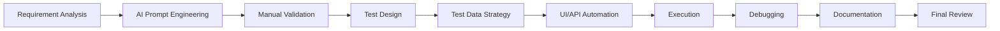

# AI Prompts — Documentation and Summary

## Objective

This document records the final AI-assisted documentation phase for the QA AI Practical Assessment. It covers how project documentation was planned, refined after implementation, and summarized for submission.

The assessment targeted the **Practice Software Testing (Toolshop)** application using the existing **Prism Playwright Framework**. All documentation describes work that was completed — manual test design, UI/API automation, execution, debugging, evidence capture, and README authoring — without redesigning the framework.

**Primary AI tool:** Cursor Enterprise  
**Secondary reviewer:** ChatGPT (documentation review and prompt refinement)

---

# Iteration 1 — Project Documentation Planning

## Objective

Establish a documentation structure and repository organization that would support assessment deliverables from requirement analysis through final submission. The goal was to define where each artifact would live, how AI prompt iterations would be recorded, and how execution evidence would be archived — before and during implementation.

## Prompt

You are a Senior QA Automation Engineer completing the QA AI Practical Assessment.

The implementation uses the existing Prism Playwright Framework for the Practice Software Testing (Toolshop) application. Do not redesign the framework.

Help me plan project documentation and repository organization for the assessment deliverables:

1. Propose a top-level repository structure separating manual test cases, automation (`PrismStructure/`), AI prompt documentation (`ai-prompts/`), and execution evidence (`Evidence/`).
2. Outline a README structure covering: project information, technologies, folder structure, prerequisites, installation, environment configuration, test data, execution commands, reports, AI prompt references, assumptions, and final results.
3. Define the `ai-prompts/` folder layout — one file per workflow stage (requirements, test design, test data, automation/debugging, documentation/summary) plus API test design reference.
4. Plan evidence organization for UI and API Playwright HTML reports, screenshots, and manual testing artifacts.
5. Draft a `project-info.md` outline describing how AI was used across the testing lifecycle without inventing implementation details not yet completed.

Return a practical documentation plan aligned to AC1 (UI) and AC2 (API) assessment scope. Use placeholder guidance where implementation is pending.

## AI Response Summary

The AI proposed a repository layout that layers assessment deliverables on top of the existing Prism framework:

| Area | Planned Location |
|---|---|
| Manual UI test cases | `FunctionalTestCase.csv` |
| Manual API test cases | `ApiTestCase.csv` |
| Framework and automation | `PrismStructure/` |
| AI prompt iterations | `ai-prompts/` |
| Execution evidence | `Evidence/Manual/`, `Evidence/UI/`, `Evidence/API/` |
| Workflow context | `project-info.md` |
| Primary documentation | `README.md` |

The README outline included eleven sections: project information, technologies, repository structure, prerequisites, installation, `.env` configuration, test data, execution commands (UI smoke/regression, API smoke/regression), HTML reporting, AI prompt references, and assumptions.

The `ai-prompts/` folder was planned with stage-specific files so each AI interaction could record objective, prompt, response summary, validation notes, and final decision — matching the pattern already used in earlier assessment phases.

Evidence organization separated UI and API Playwright HTML reports with optional screenshot captures for submission. The `project-info.md` outline covered AI tools, context provision, validation approach, and responsible AI use.

## Validation / Review

- Confirmed the plan preserved the existing Prism folder structure (`UI/`, `API/`, `commonUtils/`, `tests/`, `playwright.config.js`) without architectural changes.
- Verified planned paths matched the assessment brief deliverables (manual cases, automation, AI documentation, evidence, README).
- Cross-checked that `ai-prompts/` file names aligned with workflow stages already documented in `requirements-and-planning.md`, `test-design.md`, `test-data.md`, and `automation-and-debugging.md`.
- Rejected a suggestion to create a separate `docs/` folder — assessment artifacts belong at repository root per brief conventions.
- Rejected auto-generating a framework architecture diagram before Toolshop page objects existed; deferred architecture content until implementation was complete.
- Accepted evidence split by UI/API and the README section ordering (install → configure → execute → report → AI references).

## Final Decision

**Accepted** the documentation plan with minor adjustments:

- Kept `README.md` at repository root as the single entry point.
- Created `ai-prompts/documentation-and-summary.md` as the final-stage prompt record (this file).
- Reserved `Evidence/Manual/` for optional manual execution notes; primary evidence is Playwright HTML reports.
- Used `project-info.md` as a living workflow document, filled incrementally as each phase completed.

---

# Iteration 2 — Documentation Refinement After Implementation

## Objective

After manual test cases, UI automation, API automation, execution, and debugging were complete, refine the README and cross-references so documentation accurately reflected the implemented project. Remove inconsistencies, validate commands against `package.json` and `playwright.config.js`, and confirm folder paths and test ID mappings.

## Prompt

You are a Senior QA Automation Engineer.

Manual test cases, UI automation, API automation, execution, and debugging are complete for the Toolshop assessment using the existing Prism Playwright Framework.

Review and refine the project README and documentation references. Do not redesign the framework or invent features.

Tasks:

1. Validate the repository structure section against the actual file tree.
2. Confirm execution commands match `package.json` scripts and `playwright.config.js` project (`testcases_regression`).
3. Add traceability tables mapping `FunctionalTestCase.csv` test IDs to automated spec files (`01`–`06` UI, `01`–`05` API).
4. Verify environment variable names (`URL`, `BASE_URL`) against `.env` / `.env.example`.
5. Document test data file locations (`loginData.json`, `registrationData.json`, `productSearchData.json`, `checkoutData.json`, `toolshopApiPage.js`, `API/testdata/*.json`).
6. Align evidence paths with archived Playwright HTML reports in `Evidence/UI/` and `Evidence/API/`.
7. Ensure assumptions reflect known application behaviour (checkout double-confirm, shared demo backend, run-scoped data).
8. Remove or correct any references to files, commands, or features that were not implemented.

Return an updated README structure and a list of corrections applied.

## AI Response Summary

The AI compared the draft README against the implemented repository and produced corrections across structure, commands, and traceability:

**Repository structure validated**

- `FunctionalTestCase.csv` — 8 UI cases aligned to executed automation (`TC_LOGIN_001`–`TC_CHK_002`).
- `ApiTestCase.csv` — API manual test cases (design reference in `api-testing-design.md`; automation implements `TC_API_001`–`TC_API_005`).
- UI specs: `01_loginPageTest.spec.js` through `06_checkoutPageTest.spec.js` (8 tests).
- API specs: `01_registerUser.spec.js` through `05_invoice.spec.js` (5 serial tests).
- Toolshop page objects: `loginPage.js`, `registrationPage.js`, `homePage.js`, `productDetailsPage.js`, `shoppingCartPage.js`, `checkoutPage.js` — registered via `POManager.js`.

**Commands validated**

| Command | Verified Against |
|---|---|
| `npx playwright test --project=testcases_regression --grep @smoke --workers=2` (with explicit UI spec files) | `playwright.config.js` project + spec tags |
| `npm run test:regression` | `package.json` |
| `npx playwright test --project=testcases_regression "tests/API Test" --grep "@toolshop" --workers=1` | API serial chain |
| `npx playwright show-report` | Playwright HTML reporter (`reporter: 'html'`) |

**Corrections applied**

- Clarified that all automation commands run from `PrismStructure/`, not repository root.
- Mapped each automated scenario to its manual test ID in README tables.
- Documented that manual design produced 18 cases in `test-design.md`, but the CSV deliverable contains 8 cases aligned to executed UI automation.
- Updated evidence paths to match archived reports: `Evidence/UI/Playwright UI Automation Test Report.html` and `Evidence/API/Playwright API Test Report.html`.
- Added `executionResultLogs.log` and `API/testdata/api_requests.log` as supplementary execution logs.
- Documented checkout double-confirm as expected application behaviour, not a defect.

## Validation / Review

- Ran UI smoke and API smoke commands locally; confirmed they target the correct Playwright projects and tags.
- Opened archived HTML reports in `Evidence/` and verified they correspond to successful Toolshop runs.
- Cross-checked `FunctionalTestCase.csv` and `ApiTestCase.csv` test IDs against spec file annotations (`@smoke`, `@regression`, test titles).
- Verified `.env.example` variable names match references in specs and utilities.
- Confirmed legacy Prism samples (`02`–`04` UI specs) remain in `tests/UI Test/` but are excluded from Toolshop runs — Toolshop specs are `01`–`06`.
- Rejected README claim that screenshot PNGs were committed for both UI and API — only HTML report archives are in `Evidence/` at submission; PNG screenshots exist under `test-results/` from local runs and are referenced in README as optional evidence.
- Rejected expanding manual CSV to all 18 `test-design.md` cases — assessment scope prioritizes depth over volume (~5–8 per type).

## Final Decision

**Accepted** the refined README (`readme.md`) as the authoritative project document. Cross-references in `ai-prompts/` files now point to implemented paths and completed deliverables. Documentation matches the implemented Toolshop automation without describing unbuilt features.

---

# Iteration 3 — Final Assessment Summary

## Objective

Produce a concise final summary of the AI-assisted QA workflow: what AI generated, what required manual validation, what was accepted or rejected, lessons learned, best practices, project outcome, and completed repository deliverables.

## Prompt

You are a Senior QA Automation Engineer completing the final AI documentation for the QA AI Practical Assessment.

The project is complete. Document the full AI collaboration workflow across all phases (requirements, test design, test data, automation, debugging, documentation). Structure the summary into three documentation iterations.

For the final iteration, cover:

- AI collaboration workflow
- What AI generated
- What required manual validation
- What was accepted
- What was rejected
- Lessons learned
- Best practices followed
- Final project outcome
- Repository deliverables completed

Base everything on the completed Toolshop implementation using the existing Prism Playwright Framework. Do not invent features. Tone: engineer documenting an AI-assisted workflow.

## AI Response Summary

### AI Collaboration Workflow

The assessment followed a sequential, validation-gated workflow:

Each stage used Cursor Enterprise with project context (Prism framework, Toolshop SUT, AC1/AC2 scope, assessment rules). AI outputs were treated as drafts. Implementation proceeded only after manual review against the live application, Swagger documentation, or Playwright execution results.

### What AI Generated

| Phase | AI Output | Repository Artifact |
|---|---|---|
| Requirements | Risk-based module analysis, CUJ mapping, assumptions | `ai-prompts/requirements-and-planning.md` |
| Test design | 18 UI manual cases; API scenario tables | `ai-prompts/test-design.md`, `ai-prompts/api-testing-design.md` |
| Test data | Module inventory, static vs runtime classification | `ai-prompts/test-data.md`, JSON/JS data files |
| Automation | Framework analysis, page objects, specs, helpers | `PrismStructure/UI/`, `PrismStructure/tests/` |
| API automation | Auth, product, purchase-flow specs | `PrismStructure/tests/API Test/01`–`05` |
| Debugging | Root-cause analysis, locator/sync fixes | `ai-prompts/automation-and-debugging.md` |
| Documentation | README structure, repo plan, this summary | `readme.md`, `project-info.md`, this file |

### What Required Manual Validation

- **Application behaviour** — Checkout double-confirm, authenticated navigation layout, registration redirect flow.
- **API contracts** — Endpoint paths, status codes, and response schemas against Swagger.
- **Locators and timing** — `data-test` attributes, explicit waits vs fixed delays, invoice polling.
- **Test data** — Faker-generated emails for registration; API product lookup for in-stock items on shared demo backend.
- **Framework compatibility** — Legacy Prism page objects target a different application; Toolshop extended existing page objects (`loginPage.js`, `homePage.js`, etc.) without modifying core architecture.
- **Commands and paths** — npm scripts, Playwright projects, `.env` variable names verified by execution.
- **Documentation accuracy** — README tables, folder tree, and evidence paths checked against actual repository state.

### What Was Accepted

- Risk-based requirement analysis with AC1/AC2 → CUJ traceability.
- 8 UI test cases in `FunctionalTestCase.csv` (aligned 1:1 with automated specs); 5 automated API tests (`TC_API_001`–`TC_API_005`).
- Eight Toolshop UI automation tests (`TC_LOGIN_001` through `TC_CHK_002`) across 6 spec files.
- Five Toolshop API automation tests (`TC_API_001` through `TC_API_005`) as a serial chain.
- Page objects (`loginPage`, `registrationPage`, `homePage`, `productDetailsPage`, `shoppingCartPage`, `checkoutPage`) extending — not replacing — Prism patterns.
- Environment-based URLs via `.env` (`URL`, `BASE_URL`); UI login credentials in `loginData.json`; dynamic registration via Faker.
- Playwright HTML reporting with archived evidence copies.
- Iterative AI prompt documentation in `ai-prompts/`.

### What Was Rejected

| Item | Reason |
|---|---|
| Framework redesign | Assessment requires reusing existing Prism architecture |
| Reusing legacy `loginPage.js` for Toolshop without Toolshop locators | Different application URLs and locators — extended with Toolshop-specific methods |
| All 18 manual cases in CSV deliverable | Scope prioritizes depth (~5–8 per type); full design retained in `test-design.md` |
| Hardcoded product IDs | Live catalog stock changes; runtime API lookup adopted |
| Hardcoded credentials in JSON/specs | Security; moved to `.env` |
| Unverified "Sprint 5" environment assumption from AI | Not in project rules; flagged in requirements doc |
| Global catalog/invoice count assertions | Unreliable on shared public demo backend |
| Separate `docs/` folder | Assessment artifacts at repository root |
| Static `waitForTimeout` as primary sync strategy | Replaced with Playwright auto-wait and explicit state checks |

### Lessons Learned

1. **Context before code** — Providing framework structure, assessment rules, and SUT URLs upfront reduced incompatible suggestions.
2. **Iterate prompts, not entire implementations** — Debugging was more efficient when prompts targeted specific failures (locators, sync) rather than regenerating full specs.
3. **Validate against live systems** — AI assumptions about demo app behaviour (checkout, navigation) required confirmation on the actual site.
4. **Extend existing page objects for Toolshop** — Reusing `loginPage.js`, `homePage.js`, etc. with Toolshop locators preserved framework compatibility.
5. **Run-scoped data on shared backends** — Dynamic emails and API-driven product selection prevented cross-run failures.
6. **Document decisions, not just outputs** — Recording accepted/rejected items in `ai-prompts/` supports auditability and future maintenance.

### Best Practices Followed

- Page Object Model with centralized `POManager`.
- `@smoke` / `@regression` tagging for selective execution.
- Credentials and URLs in environment variables, not source control.
- Traceability from manual test ID → spec title → `testCasesMeta.json` annotations.
- HTML reporter, screenshots, video, and trace enabled for debugging.
- AI as engineering assistant; human review gate before merge.
- No framework architectural changes.

### Final Project Outcome

All assessment deliverables are complete. Manual and automated test suites execute successfully against `practicesoftwaretesting.com` and `api.practicesoftwaretesting.com`. Playwright HTML reports are generated and archived. AI prompt iterations are documented across `ai-prompts/`. The Prism framework remains structurally intact with Toolshop-specific extensions.

## Validation / Review

- Re-read `readme.md` Final Results table against repository contents — all items marked Completed.
- Confirmed eight UI and five API automated tests executed successfully (13/13 passed).
- Verified `executionResultLogs.log` contains successful Toolshop run entries (login, registration, search, cart, checkout, invalid login).
- Confirmed `ai-prompts/` contains six workflow files plus this documentation summary.
- No undocumented Toolshop features referenced in final documentation.

## Final Decision

**Accepted** this document and the completed assessment package for submission. Documentation reflects the implemented project without overstating AI contribution or omitting manual validation steps.

---

# Final Assessment Summary

| Deliverable | Status | Location / Notes |
|---|---|---|
| Requirement analysis | Completed | `ai-prompts/requirements-and-planning.md` |
| Manual UI test cases | Completed | `FunctionalTestCase.csv` (8 cases); full design in `test-design.md` (18 cases) |
| Manual API test cases | Completed | Design in `api-testing-design.md`; automation: `TC_API_001`–`TC_API_005` (5 tests) |
| Test data strategy | Completed | `ai-prompts/test-data.md`; `loginData.json`, `registrationData.json`, `productSearchData.json`, `checkoutData.json`, `toolshopApiPage.js`, `API/testdata/*.json` |
| UI automation | Completed | 6 specs in `PrismStructure/tests/UI Test/` (`01`–`06`); 8 tests; 6 page objects |
| API automation | Completed | 5 specs in `PrismStructure/tests/API Test/` (`01`–`05`); serial chain |
| Execution | Completed | UI via explicit spec list; API via `--grep @toolshop --workers=1`; **13/13 passed** |
| Debugging | Completed | Locator, sync, and assertion fixes documented in `automation-and-debugging.md` |
| HTML reports | Completed | `PrismStructure/playwright-report/`; archived in `Evidence/UI/`, `Evidence/API/` |
| AI prompt documentation | Completed | `ai-prompts/` (6 workflow files + this summary) |
| Project README | Completed | `readme.md` |
| Workflow context | Completed | `project-info.md` |
| Framework integrity | Preserved | No Prism architectural redesign |

---

# Lessons Learned

1. **Structured prompts produce reusable artifacts** — Defining objective, context, constraints ("do not redesign the framework"), and expected output format improved consistency across phases.
2. **Manual validation is non-negotiable** — AI correctly identified many risks (shared backend, double-confirm checkout) but also introduced unverified assumptions that required rejection.
3. **Extension over modification** — Extending existing page objects (`loginPage.js`, `homePage.js`, etc.) alongside legacy Prism components was the lowest-risk path to full coverage.
4. **Documentation last, validated against code** — README refinement after implementation prevented stale commands and incorrect file references.
5. **Evidence archiving matters** — Copying HTML reports to `Evidence/` provides a stable submission snapshot independent of the next local run.

---

# AI Usage Summary

| Activity | AI Role | Human Role |
|---|---|---|
| Requirement analysis | Drafted module/CUJ/risk tables | Validated against live app and Swagger |
| Test design | Generated 18 UI + API scenario drafts | Prioritized 7+7 for CSV deliverables and automation |
| Test data | Classified static vs runtime data | Implemented JSON, helpers, `.env` |
| Framework analysis | Identified reusable Prism components | Confirmed legacy vs Toolshop separation |
| UI automation | Generated page objects and specs | Debugged locators, sync, assertions |
| API automation | Generated specs and payload builders | Validated status codes and schemas |
| Debugging | Root-cause analysis from reports/traces | Applied minimal targeted fixes |
| Documentation | README structure and content drafts | Validated commands, paths, and accuracy |

**Tools:** Cursor Enterprise (primary), ChatGPT (secondary documentation review).

**Principle:** AI accelerated drafting and analysis; engineering judgment determined acceptance.

---

# Best Practices Implemented

- Reused existing Prism Playwright patterns (POM, `POManager`, logging, tagging, HTML reporter).
- Kept secrets in `.env`; provided `.env.example` template.
- Used Faker and API lookups for run-scoped data on a shared demo environment.
- Maintained test ID traceability from manual cases through automated specs.
- Tagged tests `@smoke` and `@regression` for selective CI/local execution.
- Enabled screenshot, video, and trace capture for failure diagnosis.
- Documented each AI iteration with prompt, summary, validation, and decision.
- Avoided framework redesign and unnecessary dependencies.

---

# Project Outcome

The QA AI Practical Assessment is complete. The repository delivers a validated AI-assisted QA workflow for the Toolshop application:

- **Manual testing** — Functional UI and API test cases covering authentication, catalog, cart, checkout, and invoice flows.
- **Automation** — Eight UI and five API Playwright tests integrated into the existing Prism framework (13/13 passed).
- **Execution** — Successful runs with HTML reports, execution logs, and archived evidence.
- **Documentation** — README, project workflow context, and full AI prompt history in `ai-prompts/`.

The Prism Playwright Framework was extended for Toolshop without structural changes. AI improved speed and consistency across analysis, design, implementation, and documentation; manual validation ensured accuracy against the live application and API contracts.

**Application:** [practicesoftwaretesting.com](https://practicesoftwaretesting.com)  
**API:** [api.practicesoftwaretesting.com](https://api.practicesoftwaretesting.com)  
**Swagger:** [api.practicesoftwaretesting.com/api/documentation](https://api.practicesoftwaretesting.com/api/documentation)
