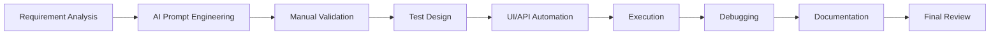
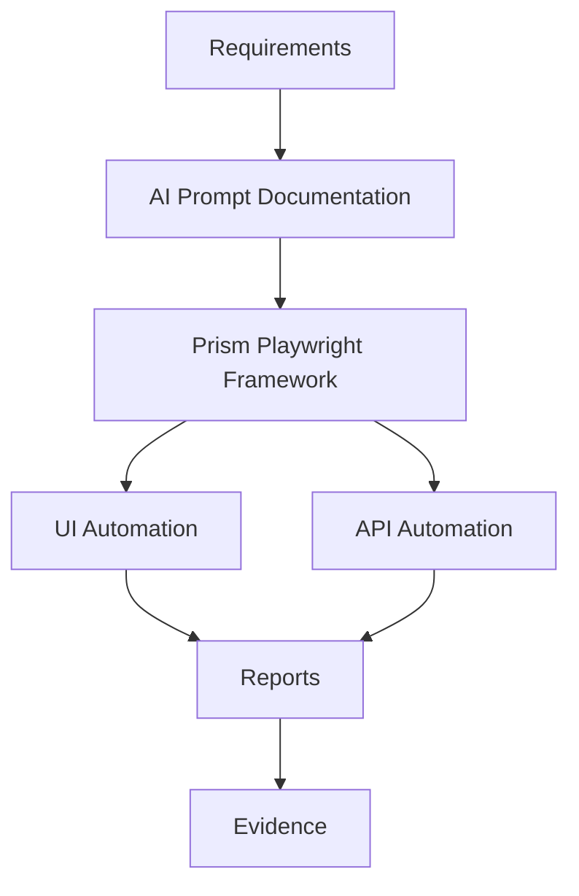

# QA AI Practical Assessment

AI-assisted Quality Assurance workflow for the **Practice Software Testing (Toolshop)** application using the **Prism Playwright Framework**.

---

## 1. Project Information

| Item | Details |
|---|---|
| **Application** | Practice Software Testing (Toolshop) |
| **UI URL** | [practicesoftwaretesting.com](https://practicesoftwaretesting.com) |
| **API URL** | [api.practicesoftwaretesting.com](https://api.practicesoftwaretesting.com) |
| **API Documentation** | [Swagger / OpenAPI](https://api.practicesoftwaretesting.com/api/documentation) |
| **Framework** | Prism Playwright Framework |

### Assessment Coverage

| Area | Deliverable | Location |
|---|---|---|
| **Manual Testing** | Functional UI test cases | `FunctionalTestCase.csv` |
| **Manual Testing** | API test cases | `ApiTestCase.csv` |
| **UI Automation** | Playwright UI specs (Toolshop + legacy Prism samples) | `PrismStructure/tests/UI Test/` |
| **API Automation** | Playwright API specs | `PrismStructure/tests/API Test/` |
| **Framework** | Page Objects, utilities, config | `PrismStructure/UI/`, `PrismStructure/API/` |
| **AI Documentation** | Prompt iterations and validation notes | `ai-prompts/` |
| **Evidence** | Execution reports and screenshots | `Evidence/` |

### Toolshop UI Automation Scenarios

`FunctionalTestCase.csv` and automated specs share the same `TC_*` test IDs, linked via `testCasesMeta.json`.

| Test ID | Module | Type | Spec File |
|---|---|---|---|
| TC_LOGIN_001 | Login | Smoke | `01_loginPageTest.spec.js` |
| TC_LOGIN_002 | Invalid Login | Regression | `01_loginPageTest.spec.js` |
| TC_REG_001 | Registration | Smoke | `02_registrationPageTest.spec.js` |
| TC_SEARCH_001 | Product Search | Smoke | `03_productSearchPageTest.spec.js` |
| TC_PD_001 | Product Details | Regression | `04_productDetailsPageTest.spec.js` |
| TC_CART_001 | Shopping Cart | Smoke | `05_shoppingCartPageTest.spec.js` |
| TC_CHK_001 | Checkout (Credit Card) | Smoke | `06_checkoutPageTest.spec.js` |
| TC_CHK_002 | Checkout Navigation | Regression | `06_checkoutPageTest.spec.js` |

> **Note:** Legacy Prism UI specs (`02_createSystemTest.spec.js`, `03_createDistrictTest.spec.js`, `04_comparepdf.spec.js`) remain in the folder but are excluded from Toolshop runs.

### Toolshop API Automation Scenarios

Five serial API tests (`@toolshop`) chain via JSON runtime files under `API/testdata/`.

| Test ID | Module | Type | Spec File | Depends On |
|---|---|---|---|---|
| TC_API_001 | User Registration | Smoke | `01_registerUser.spec.js` | — |
| TC_API_002 | User Login | Smoke | `02_loginUser.spec.js` | `TC_API_001` → `toolshopRegisteredUser.json` |
| TC_API_003 | Product Catalog | Smoke | `03_products.spec.js` | — |
| TC_API_004 | Shopping Cart | Smoke | `04_cart.spec.js` | `TC_API_002` + `TC_API_003` |
| TC_API_005 | Invoice (COD) | Smoke | `05_invoice.spec.js` | `TC_API_002` + `TC_API_004` |

---

## Key Features

- **AI-assisted requirement analysis** — Risk-based scope, critical journeys, and automation opportunities documented in `ai-prompts/requirements-and-planning.md`
- **Manual UI test design** — Functional scenarios in `FunctionalTestCase.csv` (positive, negative, validation)
- **Manual API test design** — API contract scenarios in `ApiTestCase.csv` (request/response validation)
- **Playwright UI automation** — 8 Toolshop UI tests across 6 specs in `PrismStructure/tests/UI Test/` (`01`–`06`)
- **Playwright API automation** — 5 serial Toolshop API tests in `PrismStructure/tests/API Test/` (`01_registerUser`–`05_invoice`)
- **Page Object Model (POM)** — UI page objects via `POManager.js`; API endpoints via `toolshopApiPage.js`
- **Dynamic test data generation** — Faker-based registration email/password at runtime; API state persisted in `API/testdata/*.json`
- **Environment-based configuration** — Base URLs via `PrismStructure/.env`; UI login credentials in `loginData.json`
- **HTML reporting** — Playwright HTML reporter (`reporter: 'html'` in `playwright.config.js`)
- **AI prompt documentation** — Iterative prompts and validation notes in `ai-prompts/`
- **Execution evidence** — Archived reports and screenshots in `Evidence/`

---

## AI-Assisted Workflow

This assessment followed a structured AI-assisted QA workflow. Each stage used Cursor Enterprise with project context (Prism framework, Toolshop SUT, AC1/AC2 scope) before moving to implementation.



All AI-generated outputs—including requirement analysis, test cases, automation code, and documentation—were **manually validated** against the live Toolshop application, Swagger API documentation, and Playwright execution results before being accepted into the repository. AI acted as an engineering assistant; human review determined what was implemented.

---

## Framework Architecture

The solution layers assessment deliverables on the existing Prism Playwright Framework without redesigning its core structure.



| Layer | Repository Location |
|---|---|
| Requirements | `FunctionalTestCase.csv`, `ApiTestCase.csv`, `project-info.md` |
| AI Prompt Documentation | `ai-prompts/` |
| Prism Playwright Framework | `PrismStructure/` (`UI/`, `API/`, `commonUtils/`, `playwright.config.js`) |
| UI Automation | `PrismStructure/tests/UI Test/`, `PrismStructure/UI/pageobjects/` |
| API Automation | `PrismStructure/tests/API Test/`, `PrismStructure/API/pageobjects/` |
| Reports | `PrismStructure/playwright-report/`, `PrismStructure/test-results/` |
| Evidence | `Evidence/UI/`, `Evidence/API/` |

---

## 2. Technologies Used

| Technology | Purpose |
|---|---|
| **Node.js / npm** | Runtime and package management |
| **Playwright** (`@playwright/test` ^1.40.0) | UI and API test automation |
| **dotenv** | Environment variable management |
| **@faker-js/faker** / **faker** | Dynamic test data (e.g., registration email) |
| **axios** | HTTP client utilities |
| **winston** | Logging |
| **allure-playwright** | Allure reporting support (optional) |
| **eslint** | Linting |
| **pdf-parse** | PDF validation (legacy Prism UI tests) |
| **xml2js** | Xray result conversion |
| **mysql** | Database utilities (legacy Prism framework) |

---

## 3. Repository Structure

```
qa-ai-practical-assessment/
├── README.md                          # Project documentation (this file)
├── project-info.md                    # AI workflow and assessment context
├── FunctionalTestCase.csv             # Manual UI functional test cases
├── ApiTestCase.csv                    # Manual API test cases
├── ai-prompts/                        # AI prompt documentation
│   ├── requirements-and-planning.md
│   ├── test-design.md
│   ├── test-data.md
│   ├── automation-and-debugging.md
│   ├── documentation-and-summary.md
│   └── api-testing-design.md
├── Evidence/                          # Execution evidence
│   ├── Manual/
│   ├── UI/
│   │   ├── Playwright UI Automation Test Report.html
│   │   └── Playwright UI automation html report.png
│   └── API/
│       ├── Playwright API Test Report.html
│       └── Playwright API html report.png
└── PrismStructure/                    # Prism Playwright Framework
    ├── .env                           # Environment variables (not committed)
    ├── .env.example                   # Environment variable template
    ├── package.json                   # Dependencies and npm scripts
    ├── playwright.config.js           # Playwright projects and reporter config
    ├── playwright-report/             # HTML report output (generated)
    ├── test-results/                  # Screenshots, videos, traces (generated)
    ├── executionResultLogs.log        # Execution log output
    ├── storeBrowserState.json         # Browser state storage
    ├── Jenkinsfile-UI-Automation      # CI pipeline reference (commented)
    ├── API/
    │   ├── pageobjects/
    │   │   └── toolshopApiPage.js     # Toolshop API endpoints and header builders
    │   ├── resources/data/            # Static API payloads
    │   │   ├── toolshopRegistrationData.json
    │   │   └── toolshopInvoiceData.json
    │   ├── testdata/                  # Runtime API state (generated during runs)
    │   │   ├── toolshopRegisteredUser.json
    │   │   ├── toolshopAccessToken.json
    │   │   ├── toolshopSession.json
    │   │   ├── api_requests.log
    │   │   └── commonAPIResponse/
    │   └── utilities/
    │       ├── apiHelper.js           # commonMethods (GET/POST/PUT/PATCH/DELETE)
    │       ├── requestToCurlLogger.js
    │       └── storeFullAPIResponse.js
    ├── UI/
    │   ├── pageobjects/               # Page Object Model classes
    │   │   ├── POManager.js
    │   │   ├── loginPage.js
    │   │   ├── registrationPage.js
    │   │   ├── homePage.js
    │   │   ├── productDetailsPage.js
    │   │   ├── shoppingCartPage.js
    │   │   ├── checkoutPage.js
    │   │   └── (legacy: settingPage.js, districtPage.js, navigationBar.js)
    │   ├── resources/
    │   │   ├── data/                  # UI JSON test data
    │   │   │   ├── loginData.json
    │   │   │   ├── registrationData.json
    │   │   │   ├── productSearchData.json
    │   │   │   ├── checkoutData.json
    │   │   │   └── testCasesMeta.json
    │   │   ├── images/
    │   │   └── pdf/
    │   └── utilities/
    │       ├── webUtils.js
    │       └── logger.js
    ├── commonUtils/                   # Shared utilities (Xray, logging)
    └── tests/
        ├── UI Test/                   # UI automation specs
        └── API Test/                  # API automation specs
```

---

## 4. Prerequisites

1. **Node.js** — Install from [nodejs.org](https://nodejs.org/)
2. **npm** — Included with Node.js
3. **VS Code** — Recommended IDE
4. **Playwright VS Code extension** — Microsoft Playwright extension (optional, for debugging)

---

## 5. Installation

```bash
# Clone the repository
git clone <repository-url>
cd qa-ai-practical-assessment/PrismStructure

# Install dependencies
npm install
```

All automation commands must be run from the `PrismStructure/` directory.

---

## 6. Environment Configuration (.env)

Copy the example file and configure environment variables:

```bash
cp .env.example .env
```

### Environment Variables

| Variable | Description | Example |
|---|---|---|
| `URL` | API base URL (used by `apiHelper.js`) | `https://api.practicesoftwaretesting.com` |
| `BASE_URL` | Toolshop UI base URL (used by page objects) | `https://practicesoftwaretesting.com` |

UI login credentials for the seeded demo user are stored in `UI/resources/data/loginData.json` (`validUser`, `invalidPassword`). API registration uses `API/resources/data/toolshopRegistrationData.json` with Faker-generated email at runtime.

> **Note:** `.env` is excluded from version control via `.gitignore`. Do not commit production secrets.

---

## 7. Test Data

### UI Test Data

| File | Purpose |
|---|---|
| `PrismStructure/UI/resources/data/loginData.json` | Valid/invalid login credentials and expected error messages |
| `PrismStructure/UI/resources/data/registrationData.json` | Static registration profile fields (email/password generated at runtime) |
| `PrismStructure/UI/resources/data/productSearchData.json` | Search keyword and expected result assertions |
| `PrismStructure/UI/resources/data/checkoutData.json` | Billing/shipping fields, payment method, success messages |
| `PrismStructure/UI/resources/data/testCasesMeta.json` | Keyword-to-test-ID mapping for `test_key` annotations |
| `PrismStructure/UI/resources/data/system.json` | Legacy Prism system data |

### API Test Data

| File | Purpose |
|---|---|
| `PrismStructure/API/pageobjects/toolshopApiPage.js` | Endpoints and header builders (`authHeaders`, `jsonHeaders`) |
| `PrismStructure/API/resources/data/toolshopRegistrationData.json` | Registration payload template (email generated at runtime) |
| `PrismStructure/API/resources/data/toolshopInvoiceData.json` | Invoice/COD payment payload fields |
| `PrismStructure/API/testdata/toolshopRegisteredUser.json` | Runtime — user created by `TC_API_001` |
| `PrismStructure/API/testdata/toolshopAccessToken.json` | Runtime — bearer token from `TC_API_002` |
| `PrismStructure/API/testdata/toolshopSession.json` | Runtime — product ID and cart ID from `TC_API_003`/`TC_API_004` |
| `PrismStructure/API/testdata/api_requests.log` | CURL request log (generated during API runs) |

### Environment Variables

Base URLs are loaded from `PrismStructure/.env` via `dotenv` in `playwright.config.js`. API requests use `process.env.URL`; UI page objects use `process.env.BASE_URL` (defaults to `https://practicesoftwaretesting.com` if unset).

---

## 8. Execution Commands

Run all commands from `PrismStructure/`.

### UI Smoke

Executes Toolshop UI tests tagged `@smoke` on the `testcases_regression` project (Chromium/Chrome, headed, trace/video enabled). Pass explicit Toolshop spec files to avoid legacy Prism specs that require different test data:

```bash
npx playwright test --project=testcases_regression --grep @smoke --workers=2 \
  "tests/UI Test/01_loginPageTest.spec.js" \
  "tests/UI Test/02_registrationPageTest.spec.js" \
  "tests/UI Test/03_productSearchPageTest.spec.js" \
  "tests/UI Test/05_shoppingCartPageTest.spec.js" \
  "tests/UI Test/06_checkoutPageTest.spec.js"
```

### UI Regression

```bash
npm run test:regression
```

Equivalent command (all Toolshop UI specs including regression-only cases):

```bash
npx playwright test --project=testcases_regression --grep @regression --workers=2 \
  "tests/UI Test/01_loginPageTest.spec.js" \
  "tests/UI Test/02_registrationPageTest.spec.js" \
  "tests/UI Test/03_productSearchPageTest.spec.js" \
  "tests/UI Test/04_productDetailsPageTest.spec.js" \
  "tests/UI Test/05_shoppingCartPageTest.spec.js" \
  "tests/UI Test/06_checkoutPageTest.spec.js"
```

### Full UI Suite (Smoke + Regression)

```bash
npx playwright test --project=testcases_regression --workers=2 \
  "tests/UI Test/01_loginPageTest.spec.js" \
  "tests/UI Test/02_registrationPageTest.spec.js" \
  "tests/UI Test/03_productSearchPageTest.spec.js" \
  "tests/UI Test/04_productDetailsPageTest.spec.js" \
  "tests/UI Test/05_shoppingCartPageTest.spec.js" \
  "tests/UI Test/06_checkoutPageTest.spec.js"
```

### API Suite (Serial)

Toolshop API tests run serially (`workers=1`) with `@toolshop` tag:

```bash
npx playwright test --project=testcases_regression "tests/API Test" --grep "@toolshop" --workers=1
```

### Combined UI + API

Run both suites in sequence (8 UI + 5 API = 13 tests):

```bash
npx playwright test --project=testcases_regression "tests/API Test" --grep "@toolshop" --workers=1 && \
npx playwright test --project=testcases_regression --workers=2 \
  "tests/UI Test/01_loginPageTest.spec.js" \
  "tests/UI Test/02_registrationPageTest.spec.js" \
  "tests/UI Test/03_productSearchPageTest.spec.js" \
  "tests/UI Test/04_productDetailsPageTest.spec.js" \
  "tests/UI Test/05_shoppingCartPageTest.spec.js" \
  "tests/UI Test/06_checkoutPageTest.spec.js"
```

### Additional Playwright CLI Commands

```bash
# Interactive UI mode
npx playwright test --ui

# Single test file
npx playwright test "tests/UI Test/01_loginPageTest.spec.js"

# Single test by title
npx playwright test -g "TC_LOGIN_001"

# Open HTML report
npx playwright show-report

# Codegen
npx playwright codegen https://practicesoftwaretesting.com
```

---

## 9. Execution Reports

### HTML Report

Playwright generates an HTML report after each run (configured via `reporter: 'html'` in `playwright.config.js`).

| Item | Location |
|---|---|
| Report index | `PrismStructure/playwright-report/index.html` |
| Open report locally | `npx playwright show-report` |

Archived evidence copies:

| Report | Location |
|---|---|
| UI HTML report | `Evidence/UI/Playwright UI Automation Test Report.html` |
| UI report screenshot | `Evidence/UI/Playwright UI automation html report.png` |
| API HTML report | `Evidence/API/Playwright API Test Report.html` |
| API report screenshot | `Evidence/API/Playwright API html report.png` |

### Playwright Report

The `playwright-report/` folder contains the interactive HTML report with trace viewer assets:

- `playwright-report/index.html` — Main report entry point
- `playwright-report/trace/` — Trace viewer for step-by-step debugging
- `playwright-report/data/` — Screenshots, videos, and trace archives

### Test Results Folder

Per-test artifacts are stored in `PrismStructure/test-results/`:

| Artifact | Description |
|---|---|
| `test-finished-*.png` | Screenshots (screenshot mode: `on`) |
| `video.webm` | Video recording (mode: `on`) |
| `trace.zip` | Playwright trace (trace: `on`) |

### Additional Logs

| Log | Location |
|---|---|
| Execution log | `PrismStructure/executionResultLogs.log` |
| API CURL log | `PrismStructure/API/testdata/api_requests.log` |

---

## 10. AI Prompt Documentation

Prompt iterations, AI response summaries, and manual validation notes are maintained in `ai-prompts/`:

| File | Focus |
|---|---|
| `ai-prompts/requirements-and-planning.md` | Requirement analysis, risk assessment, scope, AC1/AC2 traceability |
| `ai-prompts/test-design.md` | Manual test case design (positive, negative, validation scenarios) |
| `ai-prompts/test-data.md` | Test data strategy, static vs runtime data, env variable usage |
| `ai-prompts/automation-and-debugging.md` | Framework analysis, automation implementation, debugging approach |
| `ai-prompts/documentation-and-summary.md` | Documentation and assessment summary prompts |

Additional reference: `ai-prompts/api-testing-design.md` (API test design iterations).

Project workflow context: `project-info.md`

---

## 11. Assumptions

1. Target environment is `practicesoftwaretesting.com` with matching API at `api.practicesoftwaretesting.com`.
2. Existing **Prism Playwright** structure (POM, helpers, config, tags) is reused; core framework architecture is not redesigned.
3. Tests are tagged `@smoke` or `@regression` and kept to **depth over volume** (~5–8 cases per type).
4. Backend is a **shared public demo**; tests use **run-scoped data** and avoid asserting global catalog counts.
5. Checkout **Confirm button requires two clicks** — expected application behavior, not a defect.
6. API validation is based on **Swagger/OpenAPI** contracts and observed UI network traffic.
7. Base URLs remain in `.env`; UI demo login credentials are in `loginData.json` (not committed secrets for production).
8. Scope is **functional** (UI + API); non-functional testing is out of primary assessment scope.
9. AI outputs are **advisory** and require manual validation against the live app and Swagger before implementation.
10. Default seeded products and users may change; automation creates or selects data dynamically where practical (e.g., Faker registration, API product lookup).

---

## Final Results

| Deliverable | Status | Summary |
|---|---|---|
| **Manual UI Test Cases** | Completed | 8 cases in `FunctionalTestCase.csv` — aligned to executed UI automation (`TC_*` IDs) |
| **UI Automation** | Completed | 8 tests across 6 specs (`01_loginPageTest.spec.js`–`06_checkoutPageTest.spec.js`); **8/8 passed** |
| **API Automation** | Completed | 5 serial tests (`01_registerUser.spec.js`–`05_invoice.spec.js`); **5/5 passed** |
| **HTML Reports Generated** | Completed | `PrismStructure/playwright-report/`; archived in `Evidence/UI/` and `Evidence/API/` |
| **AI Documentation** | Completed | `ai-prompts/` — requirements, test design, test data, automation/debugging, documentation prompts; plus `api-testing-design.md` |
| **Execution Evidence Captured** | Completed | UI/API HTML reports, report screenshots, `test-results/` artifacts (screenshots, videos, traces) |

---

## References

- Toolshop UI: [practicesoftwaretesting.com](https://practicesoftwaretesting.com)
- Toolshop API: [api.practicesoftwaretesting.com](https://api.practicesoftwaretesting.com)
- Swagger Documentation: [api.practicesoftwaretesting.com/api/documentation](https://api.practicesoftwaretesting.com/api/documentation)
- Prism Framework README: `PrismStructure/README.md`
